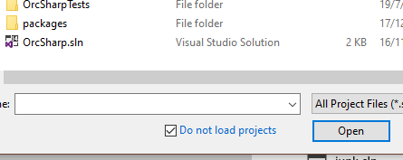

# Load All Project Dependencies for Visual Studio
## Installation
Download the extension from the [Visual Studio Marketplace](https://marketplace.visualstudio.com/items?itemName=JonKale.LoadAllDependencies)

---

LoadAllDependencies completes what Visual Studio's "Load Project Dependencies" started … when dealing with big solutions with deep reference hierarchies, it's often quicker to load the solution without loading any of the projects

then load the project you want to work on, but it won't compile without its dependencies being loaded so you right-click "Load Project Dependencies" but that only loads the ten projects your project depends on and now you've got to satisfy their dependencies too, so you right click "Load Project Dependencies" on each one in turn &c.

This is stupid - computers are much better at traversing trees than humans are. Here's a better workflow: 

- open the solution without loading any projects,
- right click on the one you want to work on, 
- "Load All Project Dependencies" 

and Visual Studio loads *all* the projects needed for your selection to compile without any more ado.

Currently the only supported project types are `.csproj`, `.fsproj`, `.sqlproj`, `.vbproj` and `.vcxproj`; all these store references in `/Project/ItemGroup/ProjectReference` with the path to the project file in the `Include` attribute.

If one or more project loads fail, the errors are written to the Output window.

## License
[BSD two-clause](LICENSE)

## Changelog
### 1.0 - 21st July 2019
> initial release
### 1.0.1 - 21st July 2019
> mandatory dumb bug fixed
