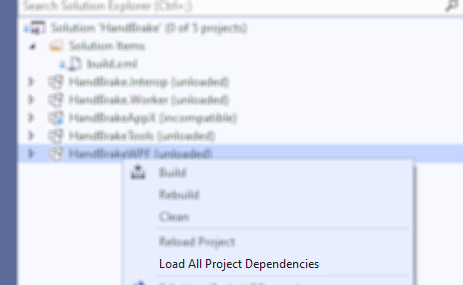
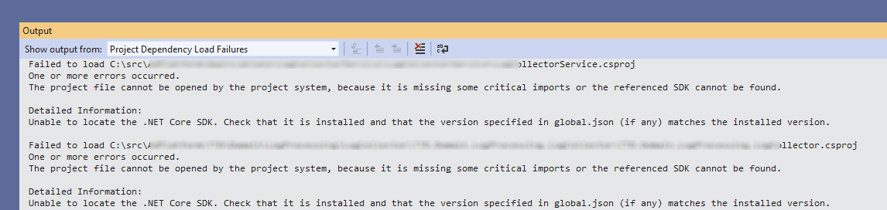

# Load All Project Dependencies for Visual Studio
## Installation
Download the extension from the [Visual Studio Marketplace](https://marketplace.visualstudio.com/items?itemName=JonKale.LoadAllDependencies)

---

LoadAllDependencies completes what Visual Studio's "Load Project Dependencies" started … when dealing with big solutions with deep reference hierarchies, open the solution without loading any projects, right click on the one you want to work on, "Load All Project Dependencies" and Visual Studio loads *all* the projects needed for your selection to compile without any more ado.

Currently the only supported project types are `.csproj`, `.fsproj`, `.sqlproj`, `.vbproj` and `.vcxproj`; all these store references in `/Project/ItemGroup/ProjectReference` with the path to the project file in the `Include` attribute.

If one or more project loads fail, the errors are written to the Output window.

## Changelog
### 1.0 - 21st July 2019
> initial release
### 1.0.1 - 21st July 2019
> mandatory dumb bug fixed
